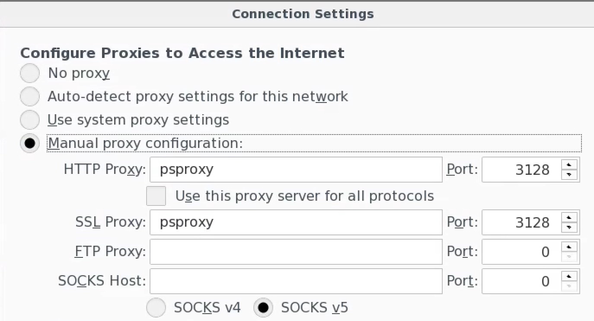

=====================
Recommended Resources
=====================

.. toctree::

   example_module

Packages We Recommend
=====================
* `Pytest <https://docs.pytest.org/en/latest>`_ -- Python Testing Framework
* `Flake8 <http://flake8.pycqa.org/en/latest>`_ -- Style Enforcement
* `Sphinx <http://www.sphinx-doc.org/en/stable>`_ -- Automated HTML Documentation
* `Ophyd <http://nsls-ii.github.io/ophyd>`_ -- EPICS Device Abstractions
* `Bluesky <http://nsls-ii.github.io/bluesky>`_ -- Generalized Experimental Plans

External Tutorials and Guides
=============================
* `Git Tutorial <http://swcarpentry.github.io/git-novice>`_ -- Thorough Git beginner guide
* `Numpy Development Guide <https://numpy.org/doc/stable/dev/index.html#development-process-summary>`_ -- A development guide from the folks at NumPy
* `PEP-8 <https://www.python.org/dev/peps/pep-0008>`_ -- Python Coding Conventions
* `Git Flight Rules <https://github.com/k88hudson/git-flight-rules>`_ -- Specific instructions for performing advanced tasks in Git
* `Numpydoc Docstring Guide <https://numpydoc.readthedocs.io/en/latest/format.html>`_ -- Guide to making NumPy style documentation
* `Conda <https://conda.io/docs/user-guide/getting-started.html>`_ -- Getting started guide for using Conda

Internal Access
===============
If you would like to access this site from the internal SLAC intranet, you need
to link to the proxy server in your Firefox profile. Under Settings ->
Preferences -> Advanced -> Network -> Connection, enter the proxy information
like so:

